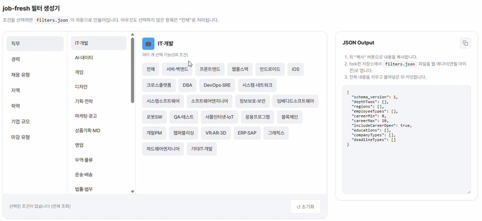
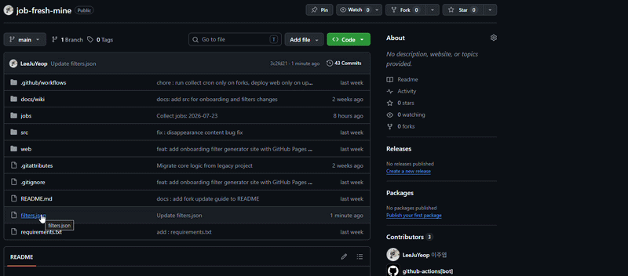

# 🌿job-fresh🌿

밤사이 **잡프레시**가 신규 채용공고를 골라 내 GitHub에 배달해 놓습니다!

자고 일어나서 등교/출근하며 새로운 채용공고를 확인하세요!

- 이 저장소를 **Fork**하면 내 계정의 GitHub Actions가 매일 아침(KST 07:00) 공고를 수집합니다.
- 공고는 `jobs/` 폴더에 저장되고, **14일**이 지나면 자동 정리됩니다.


## 🔥시작하기🔥

1. **Fork** — 우측 상단 Fork 버튼으로 내 깃 계정에 복사합니다.
2. **필터 설정** — 루트의 `filters.json`을 수정합니다. [필터 생성기 웹페이지](https://leejuyeop.github.io/job-fresh/)에서 클릭만으로 JSON을 만들어 붙여넣을 수 있습니다.

   1) 필터 생성기 웹페이지에서 조건을 선택하고 JSON을 복사합니다.

      

   2) 복사한 JSON을 내 Fork 저장소의 `filters.json` 파일 편집 화면(연필 아이콘)에 붙여넣고 커밋합니다.

      

3. **Actions 활성화** — Fork 저장소는 Actions가 기본 비활성입니다. **Actions 탭 → "I understand my workflows, go ahead and enable them"** 클릭.
4. **셀프테스트(권장)** — Actions 탭 → `job-fresh pipeline` → **Run workflow**로 즉시 1회 실행해 `jobs/` 폴더에 커밋이 생기는지 확인합니다.
5. **업데이트 받기(선택)** — 잡프레시가 업데이트되면 Fork 메인 페이지의 **Sync fork → Update branch** 버튼이 활성화됩니다. 버튼 한번으로 업데이트 하세요. 단, 충돌 시 나타나는 **Discard commits는 누르지 마세요** — 내 필터 설정과 수집된 공고가 전부 사라집니다.


## 트러블슈팅

- **아무 일도 일어나지 않아요** — Fork 저장소의 Actions가 비활성 상태면 에러 없이 조용히 실패합니다. Actions 탭에서 활성화됐는지 먼저 확인하세요.
- **수집 0건** — 필터가 너무 좁거나, 해당 날짜에 조건에 맞는 신규 공고가 없는 경우입니다. `jobs/` 폴더가 없으면 커밋도 생기지 않습니다(정상 동작).
- **크론이 정확히 07:00에 안 돌아요** — GitHub Actions 크론은 부하에 따라 수 분~수십 분 지연될 수 있습니다.


## 동작 방식

```
GitHub Actions 크론 (매일 KST 07:00)
  → 직행 공식 API에서 전날 07:00 이후 등록 공고 조회 (filters.json 필터 적용, 최대 20건)
  → 공고 본문을 마크다운으로 변환
  → jobs/{오늘 날짜}/ 에 저장 후 자동 커밋/푸시
```
- 별도 서버·시크릿 등록이 필요 없습니다. 워크플로 기본 토큰만으로 동작합니다.


## 라이선스 · 주의사항

- 수집 데이터는 직행 공식 API를 통해 얻은 것으로, 개인적인 구직 활동 용도로만 사용하세요.
- 저장 파일 스키마는 개선 과정에서 변경될 수 있습니다(`schema_version`으로 구분).
